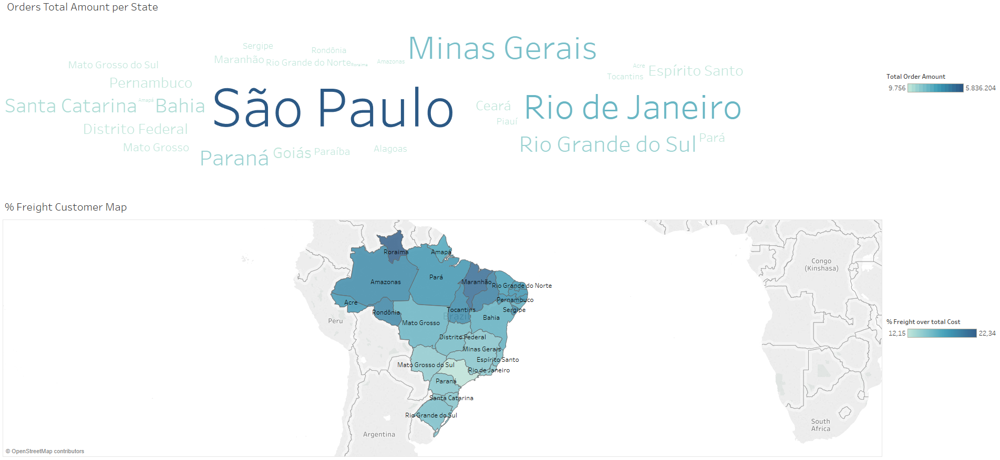
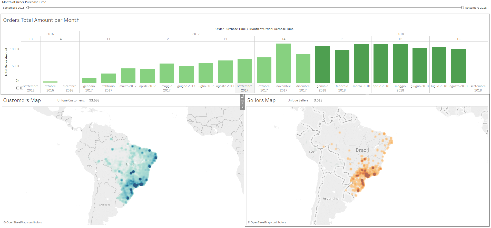
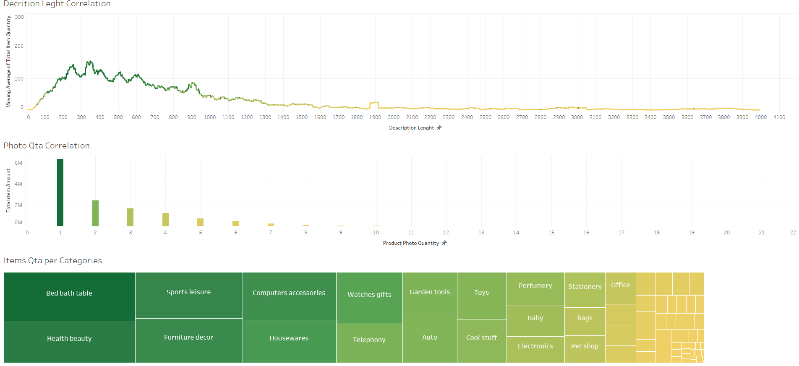
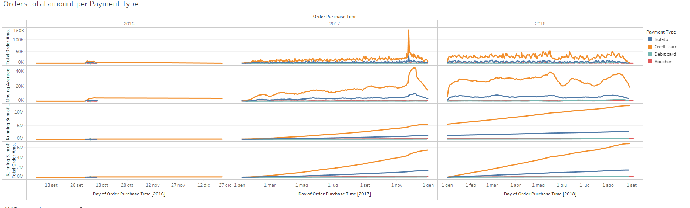

# olist_ecommerce examplained
This repo contains an academic datawarehouse project developed to test our skills in ETL processes and Data Visualization.
The choosen dataset is a public one from the Kaggle website and it contains orders data from the Olist Brazilian e-commerce.

https://www.kaggle.com/olistbr/brazilian-ecommerce

Talend Open Studio and Tableau were used to develop this project,
here some final dashboards screenshots:

"Customers dashboard"

"Temporal Dashboard"

"Products Dashboard"

"Payments analysis"

# Info
**0_DB_SETUP folder contains:**
* 0_olist_csv_dataset - all OLIST public dataset files in csv format, togheter with a script python that shows statistics about those csv files thanks to pandas libraries.  
* 1_db_sql_scripts - three sql scripts to create the *OLIST_ecommerce* database schemas on postgres 9.6+
  * To re-create a local db, copy the sql scripts text directly from the web page instead of download the files, because Downloading the files and load them through pgAdmin could cause "sintax error" problems.

**1_ETL_TALEND folder contains:**
* OLIST_ETL_v1.0 - first job to populate the OLTP schema with data from csv files.
* OLIST_ETL_v1.1 - bug fixed on v1.0, the process rejected some null values that must be stored in the OLTP schema.
* OLIST_ETL_v1.2 - error files destination moved into the project folder
* OLIST_ETL_v2.0 - Jobs to load dimensions from OLTP to DWHS completed
* OLIST_ETL_v2.0 - Jobs to load dimensions from OLTP to DWHS modified added null and unique rows checking.
* OLIST_ETL_v3.0 - Final version with orders fact table bug to be fixed 
* OLIST_ETL_v3.1 - bug fixed and MASTER JOBS created
* OLIST_ETL_v3.2 - Price and Freight values for fact were wrong, fixed
* OLIST_ETL_v4.0 - New states names thanks to new "brazil_codes_states.csv"

**2_BI_MODEL_TABLEAU folder contains:**
* OLIST_data_visualization_v1.0 - Dimensional data imported into Tableau worksheet.
* OLIST_data_visualization_v1.1 - User-friendly names defined for dimensions and measures
* OLIST_data_visualization_v1.2 - First test Sheets implemented
* OLIST_data_visualization_v1.3 - Min requirements satisfied (missing dashboards)
* OLIST_data_visualization_v1.4 - Time and Sellers Dashboards added
* OLIST_data_visualization_v1.5 - Customers and Products Dashboards added
* OLIST_data_visualization_v1.6 - Payments Dashboard addded
* OLIST_data_visualization_v2.0 - Final version of Data Visualization
* OLIST_data_visualization_v2.1 - Action filters added to dashboards

